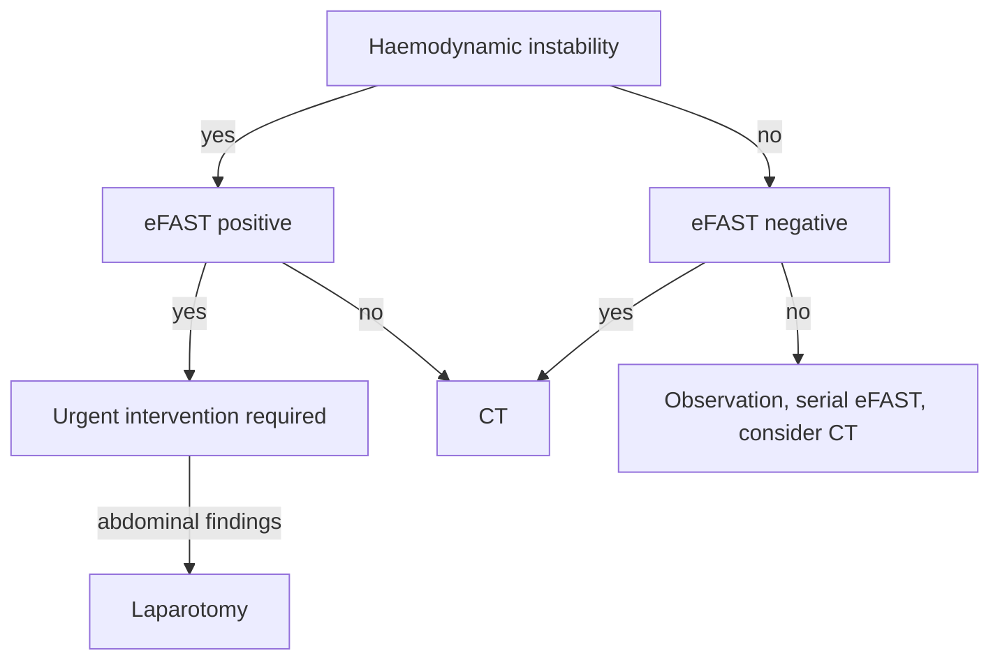

---
tags:
  - ultrasound
  - incomplete
  - medicine
created: 2025-02-20
modified: 2025-02-22
---
The RACE scan is an echocardiography protocol primarily used by the intensivist for the rapid assessment of cardiac function. There is an extended RACEplus protocol as well that provides more detailed information about cardiovascular and haemodynamic status. The staff at the Nippean institute for critical care education and research (NICCER) run excellent courses on the RACEplus scan.

# Views
- Parasternal long axis
- Parasternal short axis
- Apical two chamber
- Apical four chamber
- (Apical five chamber)
- Subcostal
- IVC & portal vein
- (Lung windows)

# Further reading:
- There is a textbook, its name escapes me...  ^35705d

---

